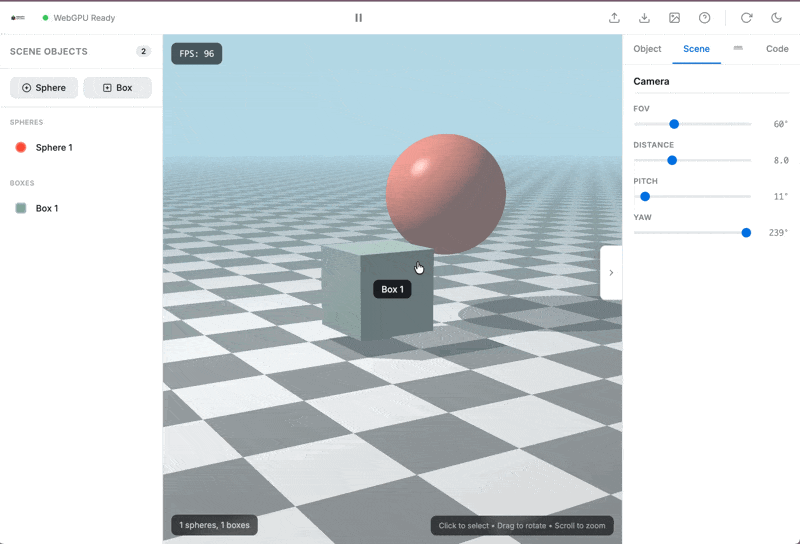

# WebGPU Scene Editor

[](https://lucashrc.github.io/Editeur-de-scene-WEBGPU/)


Editeur de scenes 3D temps reel base sur WebGPU et ray marching.
Manipulation de spheres et boites directement dans la scene, export/import JSON.

---

## Fonctionnalites

<table>
<tr>
<td width="50%">

**Selection des objets 3D**


</td>
<td width="50%">

**Deplacement via controles**


</td>
</tr>
<tr>
<td width="50%">

**Camera orbitale**


</td>
<td width="50%">

**Duplication et focus**


</td>
</tr>
<tr>
<td width="50%">

**Renommage des objets**


</td>
<td width="50%">

**Theme sombre / clair**



</td>
</tr>
<tr>
<td width="50%">

**Export de la scene**


</td>
<td width="50%">

**Import d'une scene**


</td>
</tr>
</table>

---

## Stack technique

- WebGPU + WGSL (ray marching)
- React 18 + TypeScript
- Vite

---

## Installation

```bash
npm install
```

## Developpement

```bash
npm run dev
# http://localhost:5180
```

## Build

```bash
npm run build
```

---

## Raccourcis

| Touche | Action |
| --- | --- |
| `Delete` | Supprimer l'objet |
| `D` | Dupliquer |
| `F` | Focus camera |
| `Esc` | Deselectionner |
| `Space` | Pause / Play |
| Molette | Zoom |
| Drag viewport | Orbite camera |

---

## Licence

MIT
